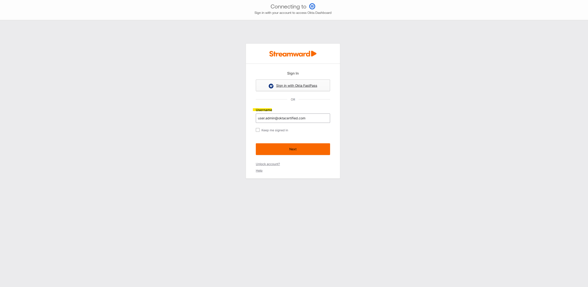
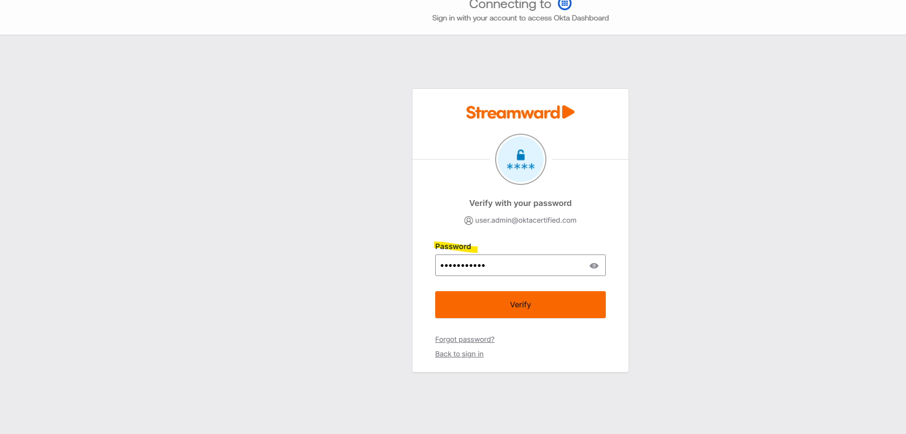
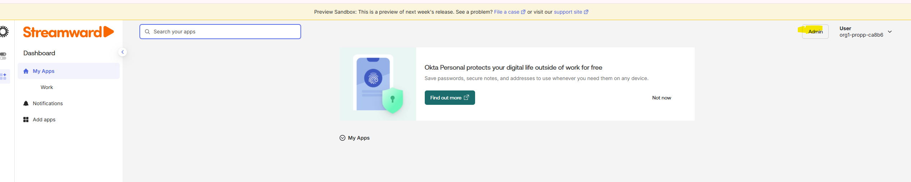

# Lab 01: Customize Your Okta Organization

## Overview / Objective

This lab focused on customizing an Okta organization to align with company branding and administrative requirements. The objective was to become familiar with the Okta Admin Console while configuring organization settings that improve the user authentication experience.

## Skills Practiced

- Identity and Access Management (IAM)
- Okta Administration
- Tenant Configuration
- Organizational Branding
- User Experience Management
- Administrative Configuration

## Lab Scenario

As an Okta Administrator, I was tasked with customizing an organization's Okta tenant to create a branded and professional sign-in experience for users. This included reviewing administrative settings and applying branding configurations within the Okta Admin Console.

## Tasks Completed

### Step 1: Customized the Okta Sign-In Page

**Screenshot**

**Explanation**

Configured the organization's sign-in page branding by applying a custom company logo and visual styling. This provides users with a familiar and trusted authentication experience.

### Step 2: Verified Authentication Branding

**Screenshot**

**Explanation**

Verified that branding elements remained consistent throughout the authentication process, including password verification screens.

### Step 3: Validated End User Experience

**Screenshot**

**Explanation**

Confirmed that branding changes were successfully applied after authentication and were visible throughout the user dashboard experience.

---

### Step 2: Navigated to Customization Settings

**Purpose:**  
Located the branding and customization settings available within the Okta Admin Console.

**Explanation:**  
Organizations can customize various aspects of the sign-in experience to provide a consistent look and feel that aligns with company branding standards.

**Screenshot:**  
*Insert screenshot here*
---

### Step 3: Updated Organization Branding

**Purpose:**  
Configured organization branding settings such as logos, colors, and visual elements.

**Explanation:**  
Branding helps create a professional user experience while increasing user trust during authentication and application access.
### Step 3: Updated Organization Branding

**Screenshot:**

---

### Step 4: Verified Configuration Changes

**Purpose:**  
Reviewed and validated that branding changes were successfully applied.

**Explanation:**  
Testing administrative changes ensures configurations are working correctly and provides quality assurance before production use.

### Step 4: Verified Configuration Changes

**Screenshot:**

---

## Key Concepts Learned

- Okta Organization Management
- Tenant Administration
- Branding and Customization
- Administrative Console Navigation
- Identity Platform Configuration
- User Experience Enhancement

## Outcomes

- Successfully customized an Okta organization.
- Gained hands-on experience navigating the Okta Admin Console.
- Learned how branding impacts user trust and adoption.
- Developed foundational Okta administration skills.
- Improved understanding of tenant-level configuration management.

## Business Value

Customizing an Okta organization provides a consistent authentication experience, reinforces organizational branding, and improves user confidence when accessing company resources. These skills are valuable for IAM professionals responsible for identity platform administration and user experience management.
