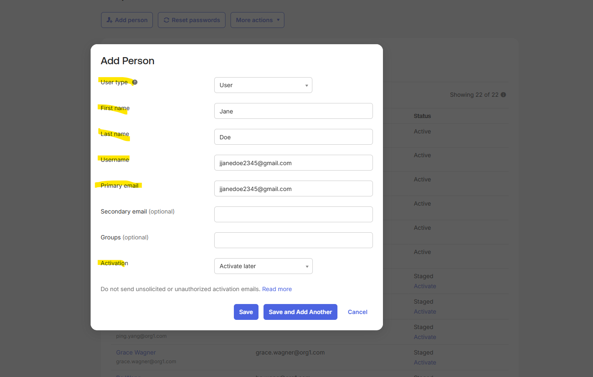
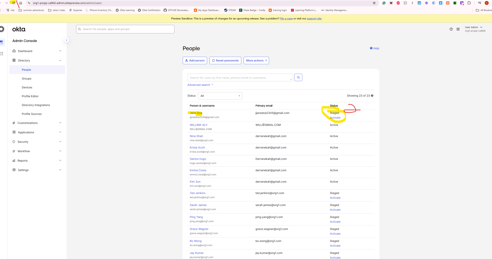
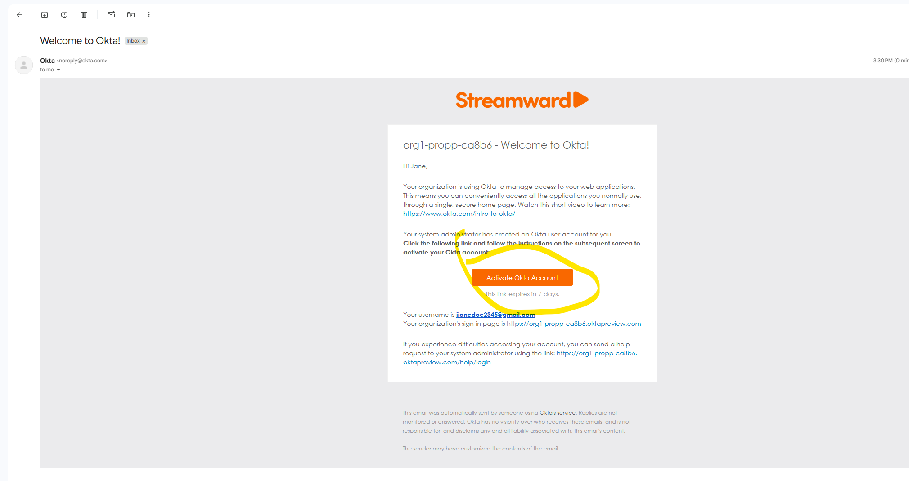
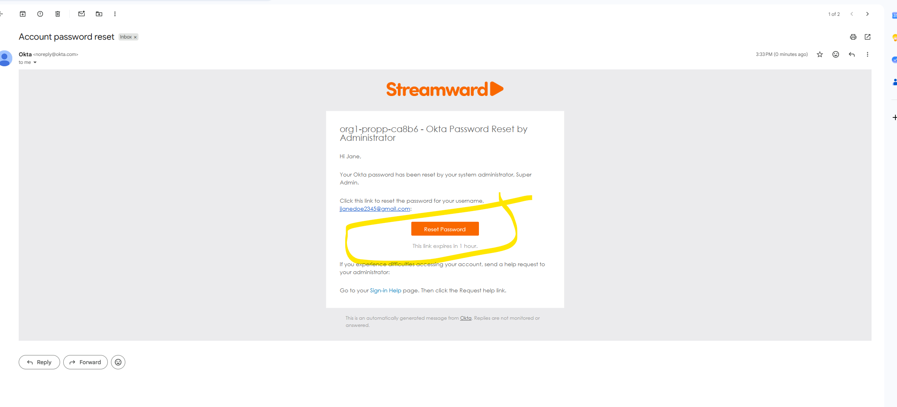

# User Lifecycle Management

## Objective
Manage the complete user lifecycle in Okta, including user creation, account management, and deprovisioning.

## Technologies Used
- Okta Universal Directory
- Okta Admin Console

## Skills Practiced
- User Provisioning
- User Deprovisioning
- Account Administration
- Password Management
- Universal Directory

## Tasks Completed
- Created a new user
- Updated user profile information
- Reset user password
- Unlocked user account
- Suspended and reactivated the user
- Deactivated the user account

## Screenshots
## Screenshots

### Create User

### Edit User Profile

### Reset Password

### Unlock User Account

### Suspend User

### Reactivate User

### Deactivate User

## Key Takeaway
This lab demonstrates core Identity and Access Management (IAM) responsibilities related to managing user identities throughout the account lifecycle.
