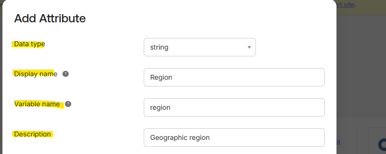

# Lab 02 — Define Your Users in Okta

## Objective

Define users in Okta by adding a custom user attribute, creating a user account, managing user statuses, and testing attribute mappings between Okta and Okta Workflows.

## Scenario

An organization needs to track user regions, create and activate a new user, manage account lifecycle statuses, and verify that profile attributes map correctly into Okta Workflows.

---

## Add a Custom Attribute

### Step 1

From the Admin Console, go to **Directory > Profile Editor**.

### Step 2

Select the **Okta User (default)** profile.

### Step 3

Add a custom attribute using the values below:

| Field | Value |
|---|---|
| Data type | string |
| Display name | Region |
| Variable name | region |
| Description | Geographic region |

### Add Custom Region Attribute

### Step 4

Add the enumerated list values:

| Display Name | Value |
|---|---|
| AMER | AMER |
| APAC | APAC |
| EMEA | EMEA |

### Step 5

Verify the user permission is set to **Read Only**, then save the changes.

---

## Create a User Account

### Step 1

From the Admin Console, go to **Directory > People**.

### Step 2

Add a new person using the following values:

| Field | Value |
|---|---|
| First name | Nina |
| Last name | Shah |
| Username | nina.shah@org1.com |
| Primary email | Personal or work email |

### Step 3

Verify that the account will activate now.

Do not set a password for the user.

> Note: Setting a password is normally only used for testing because it skips the activation email.

### Step 4

Save the user account and refresh the browser.

Verify that Nina Shah’s status is **Pending user action**.

---

## Modify the User Profile

### Step 1

Select **Nina Shah** from the People page.

### Step 2

Open the **Profile** tab and edit the user attributes.

Set the values below:

| Field | Value |
|---|---|
| Title | IT Admin |
| Primary phone | 925-555-1000 |
| User type | Employee |
| Cost center | IT |
| Organization | Org1 |
| Department | IT |
| Region | AMER |

### Step 3

Save the changes.

---

## Activate the User Account

### Step 1

Open the activation email sent to the primary email address.

### Step 2

Activate the Okta account, set a password, and set up Okta Verify.

### Step 3

Verify that the user can sign in to Okta.

### Step 4

Return to the admin account and verify that Nina Shah’s status is **Active**.

---

## Manage User Account Statuses

### Reset Password

Reset Nina Shah’s password and send a reset password email.

Verify that the user status changes to **Password reset**.

After the password is reset, verify the status returns to **Active**.

---

### Expire Password

Create a temporary password for Nina Shah.

Verify that the user status changes to **Password expired**.

After the user signs in with the temporary password and creates a new one, verify the status returns to **Active**.

---

### Unlock User Account

Enter the wrong password multiple times to lock the account.

Verify that Nina Shah’s status changes to **User is locked out**.

Unlock the account and verify the status returns to **Active**.

---

### Suspend and Deactivate User

Suspend Nina Shah’s account.

Verify that the status changes to **Suspended**.

Attempt to sign in as Nina Shah and verify the sign-in is blocked.

Deactivate the user account and verify that the status changes to **Deactivated**.

---

## Test Attribute Mappings

### Step 1

From the Admin Console, go to **Directory > Profile Editor**.

### Step 2

Next to **Okta Workflows User**, select **Mappings**.

### Step 3

Open the **Okta User to Okta Workflows** tab and verify the mappings.

| Okta User Profile | Okta Workflows User Profile |
|---|---|
| user.firstName | givenName |
| user.lastName | familyName |
| user.email | email |
| primaryRole expression | primaryRole |

### Step 4

Verify that the `user.firstName` to `givenName` mapping is set to:

`Apply mapping on user create and update`

---

## Validate Mapping Behavior

### Step 1

View the admin user profile in Okta and confirm the first name, last name, primary email, and admin role.

### Step 2

Open **Workflow > Workflows Console > Settings > Role assignments**.

Verify that the Okta Workflows profile matches the Okta user profile.

### Step 3

Update the user’s first name in Okta and verify the change appears in Okta Workflows.

### Step 4

Change the mapping setting to:

`Apply mapping on user create only`

### Step 5

Update the first name again and verify that Okta Workflows does not update.

### Step 6

Reset the mapping back to:

`Apply mapping on user create and update`

### Step 7

Verify that Okta Workflows updates again after the mapping is reset.

---

## Skills Practiced

- Okta user profile management  
- Custom attribute creation  
- User lifecycle administration  
- Password reset and password expiration  
- Account lockout and unlock workflows  
- User suspension and deactivation  
- Okta Expression Language mapping logic  
- Okta Workflows profile mapping validation  
- Identity and Access Management lifecycle operations  

---

## Lab Outcome

Successfully defined and managed users in Okta by creating a custom Region attribute, adding and activating a user account, managing user lifecycle statuses, and testing profile mappings between Okta and Okta Workflows.
