# Groups and Group Rules

## Objective
Manage user access using groups and automated group membership rules.

## Technologies Used
- Okta Universal Directory
- Group Rules

## Skills Practiced
- RBAC
- Group Management
- Dynamic Group Rules
- Access Management

## Tasks Completed
- Created security groups
- Added users to groups
- Configured group rules
- Verified automatic group assignments
- Managed group memberships

## Screenshots

### Create Group
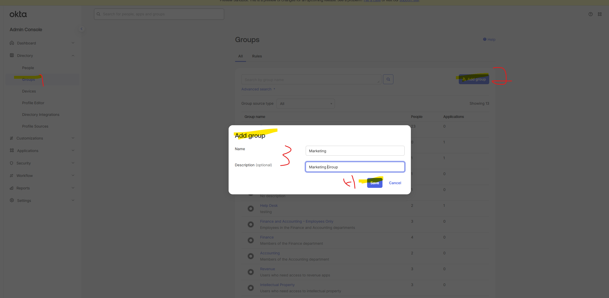

### Add one user manually
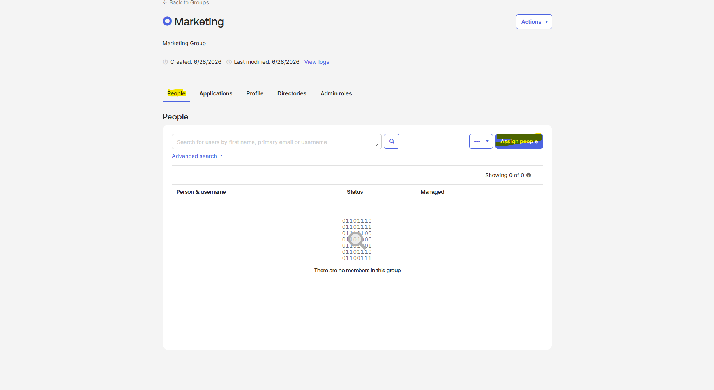

### Verify Group Creation
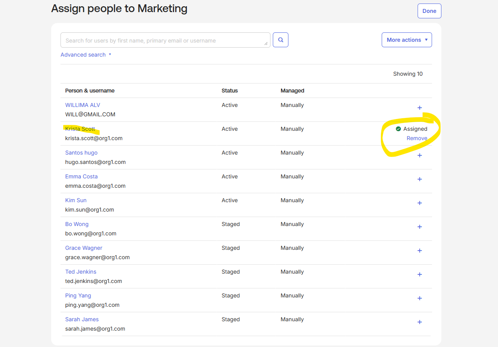

### Create Group Rule
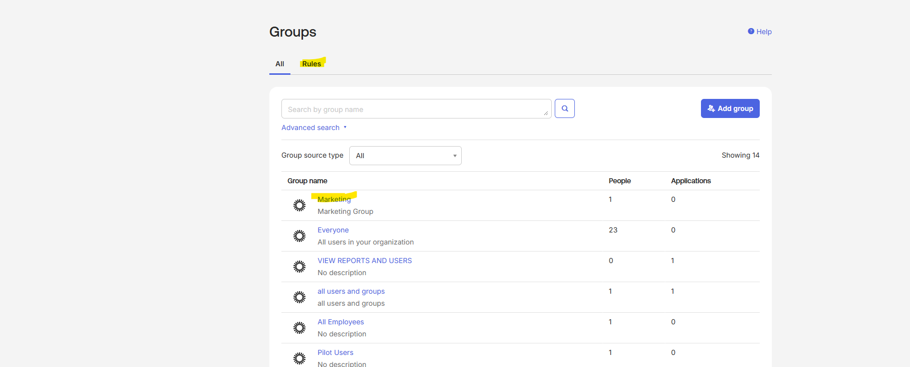

### Create group Rule cont
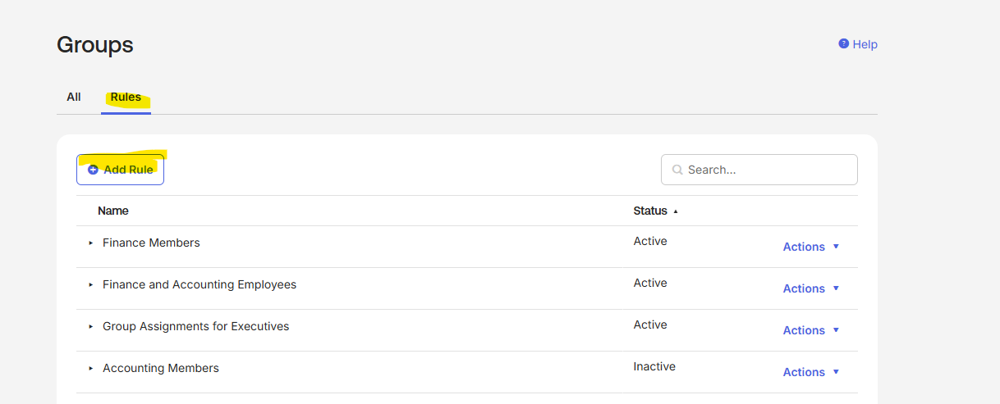

### Configure Rule Conditions
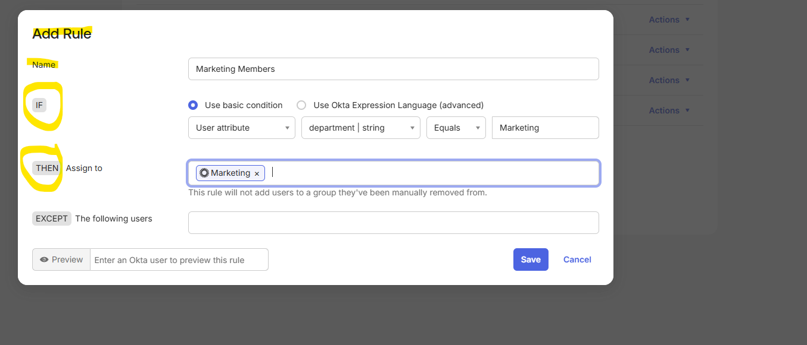

### Activate Group Rule
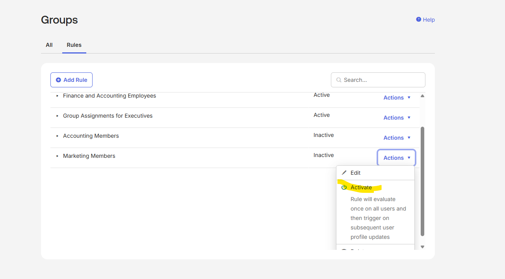

### Review user profile
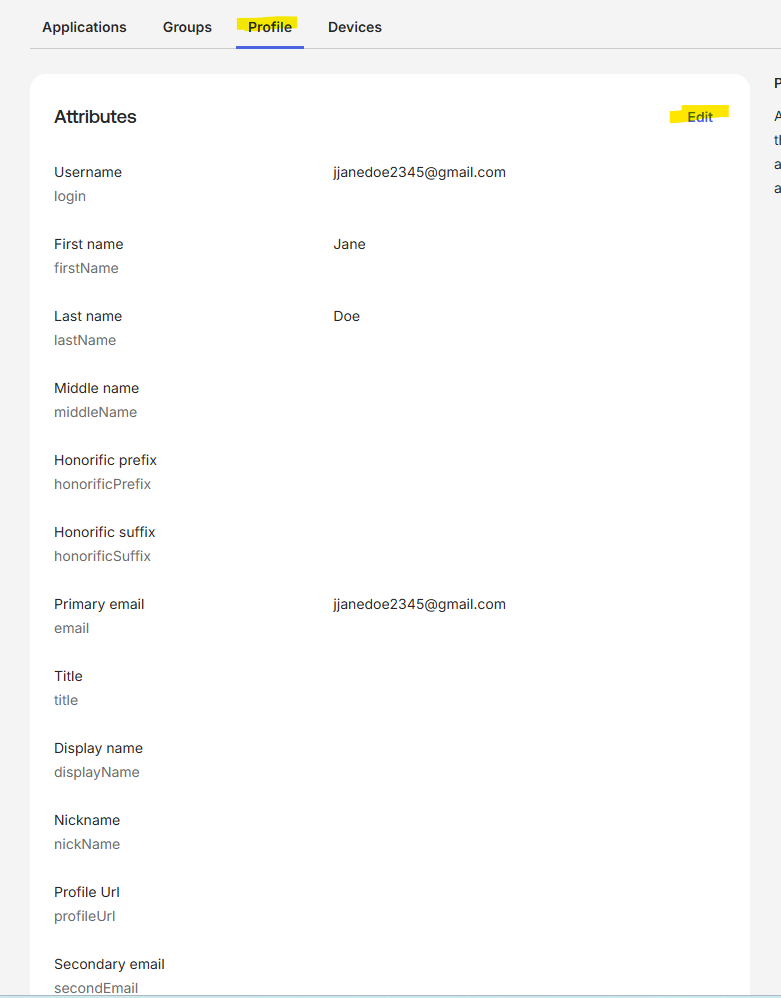

### Add marketing group to user profile
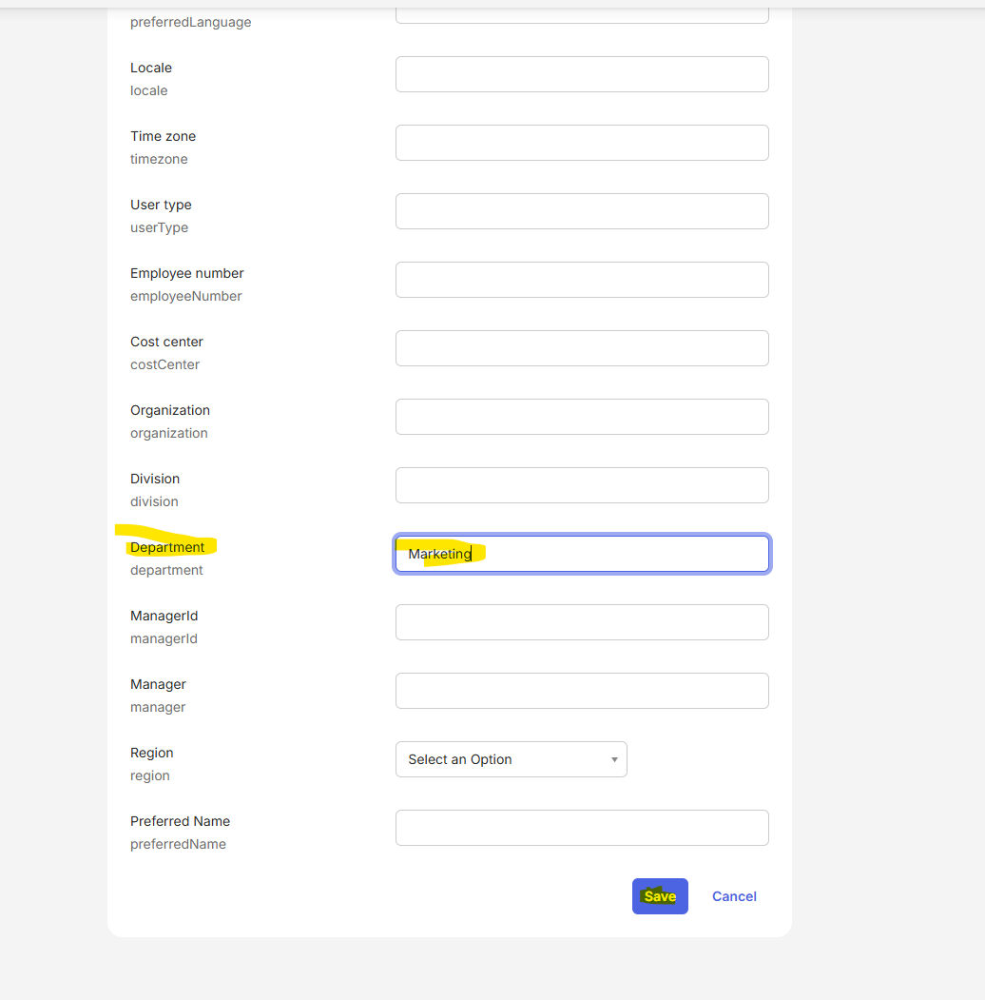

### Make sure user was added to group by rule 
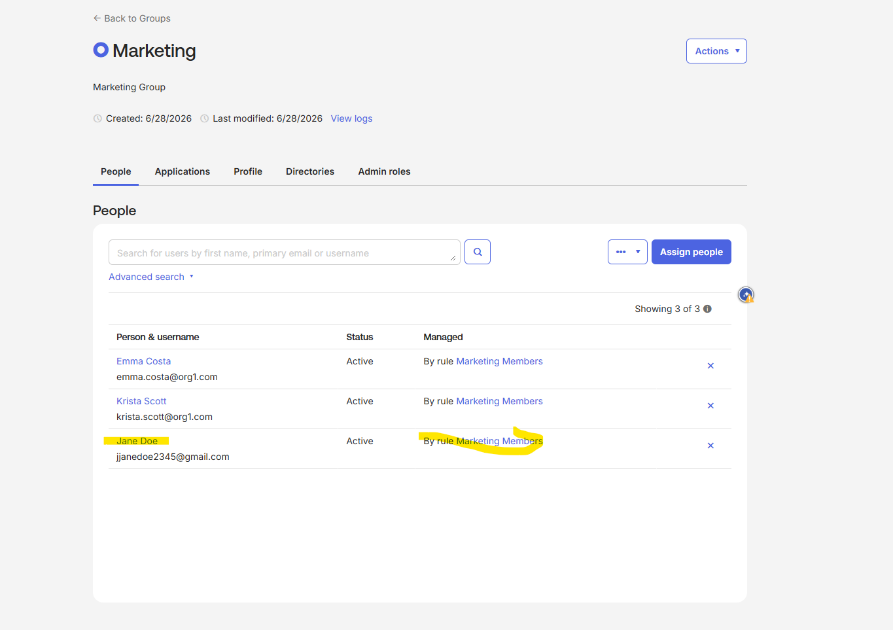

### Verify Group Membership
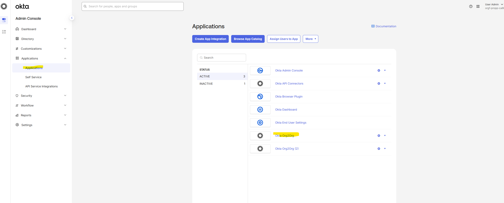

### Assign Group to App 
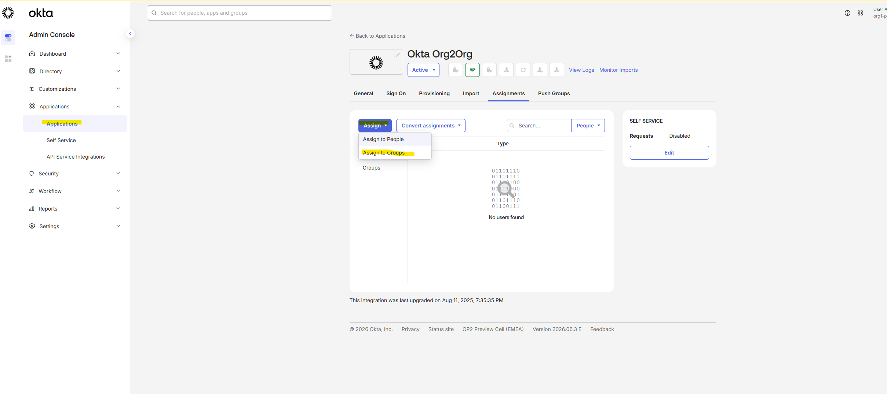

### Assign group to app cont
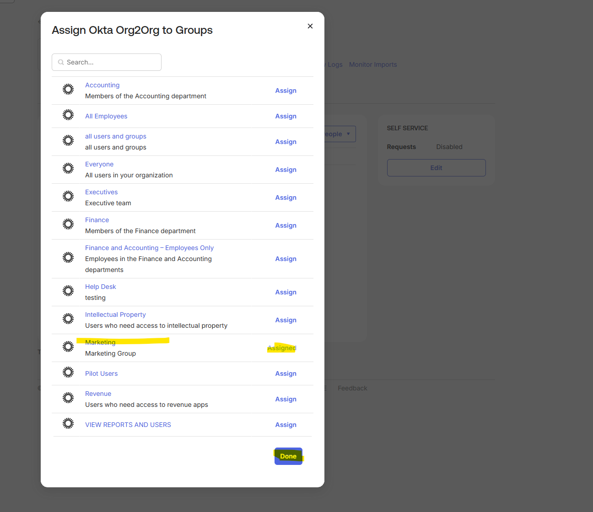

### Final Verification
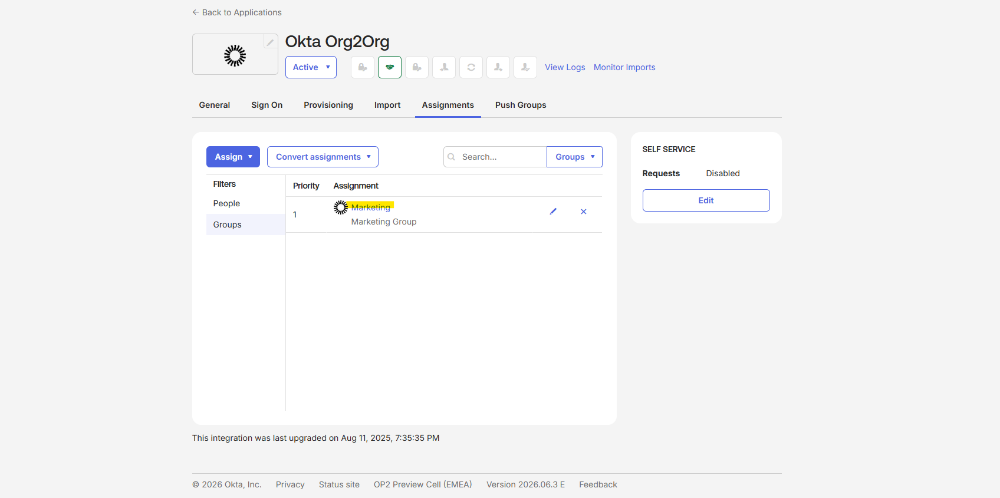

## Key Takeaway
This lab demonstrates Role-Based Access Control (RBAC) by assigning permissions through security groups instead of individual users.
