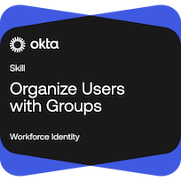

# Lab 03: Organize Users With Groups

🏅 Earned Okta Skill Badge: Organize Users With Groups



## Objective

Practice Okta group management, group rules, administrative role assignments, and Okta Expression Language to automate user access and strengthen Identity & Access Management (IAM) administration skills.

---

## Skills Practiced

- Group creation and management
- Manual group assignments
- Dynamic group assignments
- Group rule creation
- Group-based access management
- Administrative role assignments
- Okta Expression Language
- User attribute evaluation
- Group membership conditions
- Access automation

---

## Lab Scenario

In this lab, I worked through Okta administrative tasks focused on creating and managing groups, assigning users manually and dynamically, creating group rules, evaluating user attributes, and assigning administrative permissions through groups.

---

## Tasks Completed

- Created and managed Okta groups
- Assigned users to groups manually
- Built dynamic group rules using user attributes
- Evaluated group membership conditions
- Used Okta Expression Language for advanced rules
- Assigned administrative roles to groups
- Automated user assignments based on attributes
- Worked with internal user status values
- Applied group-based access management concepts

---

## Key Concepts Learned

### Manual vs Dynamic Group Assignment

Manual assignments are best suited for privileged or administrative groups where access should be tightly controlled.

Dynamic assignments automate membership based on user attributes and business rules.

---

### Group Rule Examples

#### Assign Non-Employees

```text
user.userType != "Employee"
```

Purpose:

Assign Contractors and Partners to an External Users group.

#### Assign High Security Users

```text
user.securityLevel >= 8
```

Purpose:

Assign users with elevated security clearances to a High Security group.

#### Assign Suspended Users

```text
user.getInternalProperty("status") == "SUSPENDED"
```

Purpose:

Automatically identify suspended accounts.

#### Assign Sales Department Users

```text
user.department == "Sales"
```

Purpose:

Automate membership in Sales-related groups.

---

## Administrative Access Management

Administrative roles can be assigned directly to groups to simplify administration and ensure consistent permissions across teams.

Examples:

- Help Desk Administrator
- Application Administrator
- Read-Only Administrator
- Group Administrator

---

## Lessons Learned

- Group rules reduce manual administration
- Administrative roles can be assigned to groups
- Group membership can be driven by user attributes
- Internal user statuses require `getInternalProperty("status")`
- String comparisons are case-sensitive
- Group-based administration improves scalability and consistency

---

## Badge Earned

🏆 Organize Users With Groups

Topics Covered:

- Group Management
- Group Rules
- Okta Expression Language
- Administrative Roles
- Dynamic User Assignment
- Access Automation

---

## Career Relevance

This lab strengthened practical Identity & Access Management (IAM) skills related to:

- User Lifecycle Management
- Group-Based Access Control (GBAC)
- Role-Based Access Control (RBAC)
- Access Governance
- Identity Security
- Okta Administration

---

## Key Takeaway

This lab demonstrated how Okta groups can be used to automate access management, reduce administrative overhead, and support scalable Identity & Access Management (IAM) practices through dynamic group membership and role-based administration.
