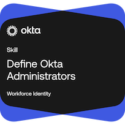

# Lab 04: Define Okta Administrators

🏆 Earned Okta Skill Badge: Define Okta Administrators

**Skill Badge Verification:**  
[View Credential](PASTE_YOUR_CREDLY_OR_OKTA_BADGE_URL_HERE)

---

## Objective

Learn how to implement delegated administration in Okta using standard administrator roles, custom administrator roles, permission groups, and resource sets while enforcing the principle of least privilege.

---

## Skills Practiced

- Standard Administrator Roles
- Custom Administrator Roles
- Permission Groups
- Resource Sets
- Delegated Administration
- Role-Based Access Control (RBAC)
- Least Privilege Access
- Access Governance
- Administrative Auditing
- Administrator Reporting
- Group-Based Role Assignments

---

## Lab Scenario

In this lab, I explored how Okta administrators can securely delegate administrative responsibilities across an organization. Activities included assigning standard administrator roles, creating custom administrator roles, configuring resource sets, auditing administrator assignments, and applying least-privilege principles.

---

## Tasks Completed

### Assigned Standard Administrator Roles

- Reviewed standard administrator role permissions
- Assigned roles based on business requirements
- Evaluated role capabilities and limitations

### Created Custom Administrator Roles

- Created custom administrator roles
- Applied permission groups
- Configured least-privilege access

### Configured Resource Sets

- Assigned resources to delegated administrators
- Restricted administrative scope
- Validated access boundaries

### Implemented Delegated Administration

- Assigned administrator permissions
- Applied resource sets
- Verified delegated access controls

### Reviewed Administrative Governance

- Examined administrator assignments
- Reviewed administrator reporting
- Audited administrative privileges

---

## Results / Verification

Successfully completed:

- Assign Standard Administrator Roles
- Assign Custom Administrator Roles
- Define Okta Administrators Lab
- Define Okta Administrators Assessment

🏆 Earned the Define Okta Administrators Skill Badge

---

## Key Takeaways

- Standard roles provide predefined administrative permissions.
- Custom roles allow organizations to tailor access to business requirements.
- Permission groups contain the individual permissions used by custom roles.
- Resource sets define what administrators can manage.
- Least privilege reduces risk by limiting unnecessary access.
- Delegated administration improves operational efficiency while maintaining governance.

---

## Outcome

Successfully demonstrated the ability to manage administrative access in Okta through standard roles, custom roles, permission groups, and resource sets while following least-privilege and identity governance best practices.
